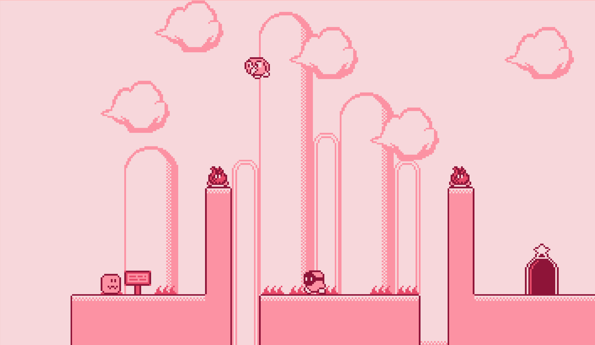

# PixelQuest - 2D Platformer Game

A modern 2D platformer game built with TypeScript and Kaboom.js, featuring pixel art graphics and smooth gameplay mechanics.




## ✨ Features

- 🎮 **Smooth Gameplay** - Responsive controls with arrow keys and spacebar
- 🎨 **Pixel Art Graphics** - Beautiful retro-style visuals with animated sprites
- 🏃‍♂️ **Character Movement** - Jump, run, and navigate through challenging levels
- 👾 **Enemy AI** - Various enemies with different behaviors and attack patterns
- 🗺️ **Multiple Levels** - Explore different environments with unique challenges
- ⚡ **Physics Engine** - Realistic gravity and collision detection
- 🎯 **Game State Management** - Seamless level transitions and progress tracking

## 🚀 Quick Start

### Prerequisites
- Node.js (v18+)
- npm or yarn

### Installation & Setup
```bash
# Clone the repository
git clone <repository-url>
cd PixelQuest

# Install dependencies
npm install

# Start development server
npm run dev
```

Visit `http://localhost:5173` to play the game.

## 🎮 How to Play

- **Arrow Keys** - Move left/right
- **Spacebar** - Jump
- **Avoid enemies** - Don't touch them or you'll take damage
- **Jump on enemies** - Defeat them by landing on their heads
- **Reach the goal** - Complete each level to progress

## 🛠️ Tech Stack

**Game Engine:**
- Kaboom.js - Lightweight 2D game framework
- TypeScript - Type-safe JavaScript development
- Vite - Fast build tool and dev server

**Graphics & Assets:**
- HTML5 Canvas - Game rendering
- CSS3 - UI styling and responsiveness
- Pixel art sprites - Retro game aesthetics

## 📁 Project Structure

```
PixelQuest/
├── src/
│   ├── main.ts           # Game entry point
│   ├── kaboomCtx.ts      # Kaboom.js context
│   ├── entities.ts       # Game entities (player, enemies)
│   ├── state.ts          # Game state management
│   ├── utils.ts          # Utility functions
│   └── constants.ts      # Game constants
├── public/
│   ├── kirby-like.png    # Sprite sheet
│   ├── level-1.png       # Level 1 background
│   ├── level-2.png       # Level 2 background
│   ├── level-1.json      # Level 1 layout data
│   └── level-2.json      # Level 2 layout data
├── index.html            # Main HTML file
└── package.json          # Dependencies and scripts
```

## 🎯 Game Mechanics

### Player Character
- **Movement**: Smooth horizontal movement with acceleration
- **Jumping**: Variable jump height based on key press duration
- **Health System**: Take damage from enemies, respawn at checkpoints
- **Animations**: Idle, walking, and special ability animations

### Enemies
- **Flame Enemies**: Stationary fire hazards
- **Guy Enemies**: Walking enemies that patrol platforms
- **Bird Enemies**: Flying enemies with random movement patterns

### Level Design
- **Tile-based Maps**: Built using sprite sheets and JSON layouts
- **Spawn Points**: Dynamic enemy and player positioning
- **Camera System**: Smooth camera following with boundaries

## 🔧 Development

### Building for Production
```bash
npm run build
```

### Preview Production Build
```bash
npm run preview
```

### Development Workflow
1. Make changes to TypeScript files in `src/`
2. Vite provides hot module replacement for instant feedback
3. Test gameplay mechanics and level progression
4. Build and deploy when ready

## 🎨 Customization

### Adding New Levels
1. Create level sprite sheet in `public/`
2. Add level JSON layout file
3. Update `main.ts` with new scene configuration
4. Add spawn points and enemy placement

### Modifying Game Mechanics
- Edit `entities.ts` for player/enemy behavior
- Update `constants.ts` for game balance
- Modify `state.ts` for game progression logic

## 🤝 Contributing

1. Fork the repository
2. Create a feature branch (`git checkout -b feature/amazing-feature`)
3. Commit your changes (`git commit -m 'Add amazing feature'`)
4. Push to the branch (`git push origin feature/amazing-feature`)
5. Open a Pull Request

## 📄 License

MIT License - see [LICENSE](LICENSE) for details.

---

**Built with ❤️ using TypeScript and Kaboom.js**


